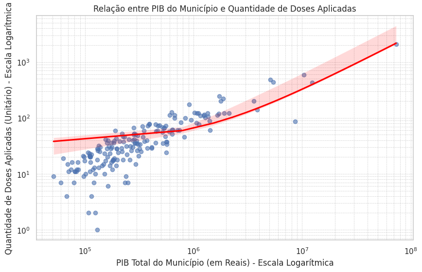
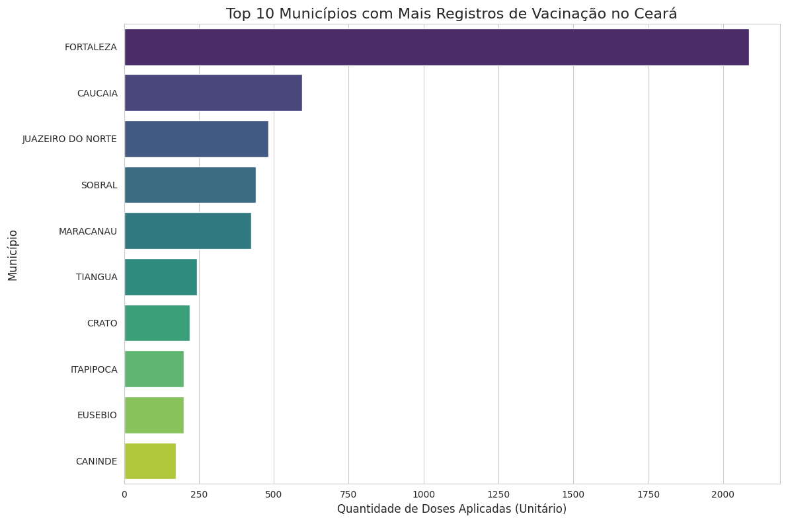

# 💉 Análise de Eficiência Vacinal no Ceará: Uma Abordagem Data-Driven


## 📋 Sobre o Projeto

Este projeto consiste em uma análise de dados end-to-end focada na imunização infantil (0 a 2 anos) no estado do Ceará. O objetivo principal foi investigar a relação entre o poder econômico municipal (PIB) e a cobertura vacinal, utilizando técnicas de **Engenharia de Dados** para tratamento de múltiplas fontes e **Estatística Descritiva** para validação de hipóteses.

O projeto foi estruturado em Sprints, simulando um ambiente real de desenvolvimento ágil de dados, cobrindo desde a ingestão e limpeza (ETL) até a criação de Dashboards Interativos.

## 🎯 Principais Insights & Resultados

A análise revelou padrões importantes sobre a distribuição de saúde pública no estado:

* **Forte Correlação Econômica:** Foi identificada uma **Correlação de Pearson de ~0.95** entre o PIB total do município e a quantidade absoluta de doses aplicadas. Isso indica uma forte linearidade entre o desenvolvimento econômico e o acesso/registro de vacinas em números absolutos.
* **Concentração Geográfica:** O município de **Fortaleza** lidera isoladamente o ranking, seguido por Caucaia e Juazeiro do Norte, refletindo a densidade demográfica e econômica.
* **Vacinas Predominantes:** A análise identificou a **MenACWY** e a **HepB** como as vacinas com maior volume de aplicação no período analisado para o público infantil.

## 🛠️ Arquitetura e Metodologia (Pipeline)

O projeto segue um fluxo linear de dados dividido em três etapas críticas:

1.  **Ingestão e ETL (Extract, Transform, Load):**
    * Processamento de arquivos brutos heterogêneos: CSV (PIB) e múltiplos JSONs (Vacinação).
    * Normalização de encoding e tipagem de dados.
    * Filtragem geoespacial (Municípios do Ceará - IBGE 23).
    * Higienização de strings e tratamento de dados nulos/ausentes.

2.  **Análise Exploratória (EDA):**
    * Segmentação por faixa etária (0-2 anos).
    * Distribuição de frequência por tipo de imunizante.
    * Identificação de *Outliers* e cidades com baixa cobertura.

3.  **Modelagem e Visualização:**
    * **Join de Datasets:** Cruzamento de dados de Saúde e Economia via chaves do IBGE.
    * **Cálculo de Correlação:** Aplicação do método de Pearson.
    * **Dashboarding:** Geração de gráficos interativos com Plotly para análise comparativa.

## 🧰 Stack Tecnológica

* **Linguagem:** Python 3
* **Manipulação de Dados:** Pandas, Glob, OS
* **Visualização Estática:** Matplotlib, Seaborn
* **Visualização Interativa:** Plotly (Graph Objects & Express)
* **Estatística:** Scipy/Pandas Corr

## 📊 Visualizações do Projeto

*(Espaço reservado para as imagens geradas pelo notebook. Recomendo subir os PNGs para a pasta /images do repo e linkar aqui)*

| Correlação PIB x Doses | Top 10 Municípios |
|:---:|:---:|
|  |  |

## 🚀 Como Executar

1. **Clone o repositório:**
```bash
git clone [https://github.com/seu-usuario/vacina-ceara-analytics.git](https://github.com/seu-usuario/vacina-ceara-analytics.git)
cd vacina-ceara-analytics